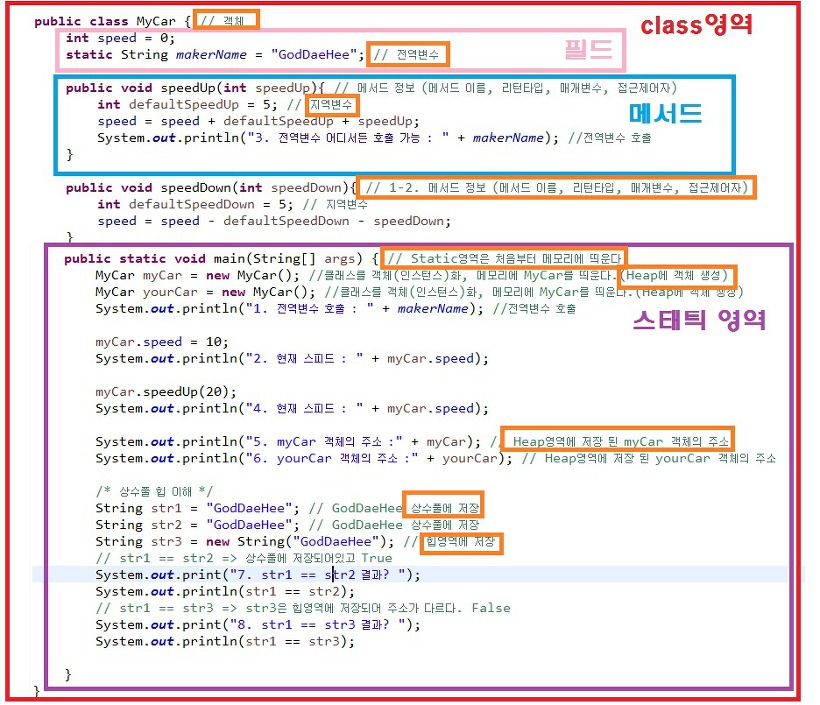
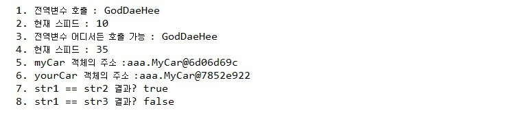

### 메모리 구조의 공부 필요성
---
- 메모리 관리 부족으로 서비스 속도 저하에서부터 심하게는 서버 불능 상태에 이르기도 한다.
- 이러한 문제점이 일어나지 않고, 또한 한정된 자원에서 효율적으로 메모리를 사용하여 성능 향상도 가능하다.

### Method Area(Static Area)
- JVM이 구동 될 때 생성되며 모든 스레드가 공유하는 영역
- JVM 구동 중 사용될 클래스 파일을 읽고 클래스 별로 runtme constant pool(런타임 상수풀), field data(필드 데이터), method data(메서드 데이터), constuctor(생성자) 등을 저장.

1. 필드 정도 : 멤버 변수 이름, 데이터 타입, 접근 제어자 등의 정보
2. 메서드 정보 : 메서드 이름, 리턴 타입, 매개 변수, 접근 제어자 등의 정보
3. 상수 풀(String constant Pool)
    - Type에서 사용된 상수를 저장하는 곳(중복이 있을 시 기존의 상수 사용)
    - 문자 상수, 타입, 필드, Method reference도 상수 풀에 저장
    - final class 변수의 경우에도 상수 풀에 값 복사
4. Static 변수
    - 모든 객체가 공유 할 수 있고, 객체 생성없이 접근 가능
5. 프로그램 종료까지 메모리에 상주
6. Static 영역 데이터는 프로그램 시작 ~ 종료시까지 메모리에 남아있다.
(장점: 즉 프로그램이 종료될 때 까지 어디서든 사용이 가능)
(단점: 무분별하게 많이 사용하다 보면 메모리가 부족)

### 힙(Heap)
- 객체 배열이 생성되는 영역.
- 해당 영역에 생성된 객체와 배열은 JVM 스택 영역의 변수나 다른 객체의 필드에서 참조한다.
- 만약 참조하는 변수, 필드가 없으면 JVM이 Garbage Collector를 실행하여 해당 객체를 제거한다.

1. 객체(인스턴스 - new 연산자로 생성된 객체)가 저장되는 영역
2. 프로그램 실행 중 생성되는 모든 객체는 Heap영역에 동적으로 할당
    - Garbage Collector를 통해 메모리 반환
3. 참조형(Reference Type)의 데이터 타입을 갖는 객체(인스턴스), 배열 등은 Heap 영역에 데이터가 저장된다.
(실제 데이터가 저장된 Heap 영역의 참조값(reference value, 해시코드 / 메모리에 저장된 주소를 연결해주는 값)을 저장)

### JVM 스택 영역
- JVM 스택 영역은 스레드가 실행될 때 할당된다.(스레드마다 하나씩 존재)
- JVM 스택은 메서드를  호출 시 프레임(Frame)을 추가(Push)하고 메서드가 종료되면 해당 프레임(Frame)을 제거(pop)한다.
- 실행 순서에 따라 생성되고 소멸된다.(Last In First Out(LIFO))

### 차이점
- 힙(heap)과 스택(Stack Area)은 프로세스의 모든 스레드에 공유되는 공통 영역
- callStack은 쓰레드 생성 시 쓰레드 별로 할당되는 쓰레드별 영역

