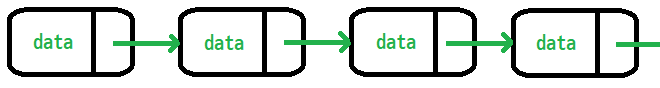
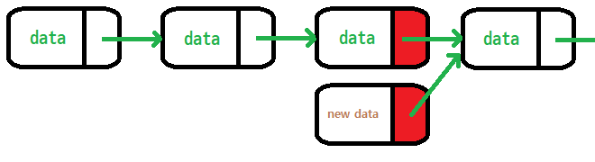
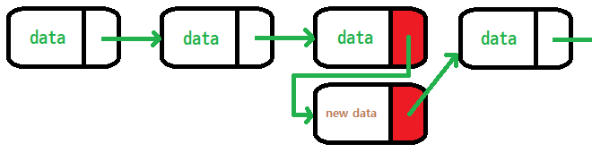
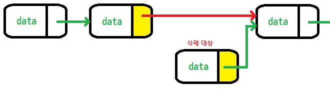
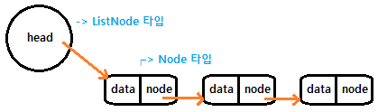

# 제어문
- 선택문
- 반복문

---

구분하기 나름이겠지만 if문은 크게 세가지 형태가 있다.
1. if(조건) { 실행 블록 }
2. if(조건) { 조건이 참일 때 실행 블록 } else { 조건이 거짓일 때 실행 블록 }
3. if(조건1) { 조건1이 참일 때 실행 블록 } else if(조건2) { 조건2가 참일 때 실행 블록 }

```java
package me.sample.study.week4;

public class Exam_01 {
    public static void main(String[] args) {

        boolean condition_1 = true;

        if(condition_1) {
            System.out.println("condtition_1 이 참 입니다.");
        }
        if(condition_1) System.out.println("condition_1이 참 입니다.");
    }
}
```

```txt
condition_1 이 참 입니다
condition_1 이 참 입니다
```

if 조건문의 소괄호 안의 내용은 boolean 으로 (참/거짓) 판별할 수 있는 값이 들어와야 한다.

```java
package me.sample.study.week4;

public class Exam_02 {
    public static void main(String[] args) {

        boolean condition_1 = true;
        boolean condition_2 = false;

        if(condition_1 && condition_2) {
            System.out.println("condition_1과 condition_2 모두 참 입니다.");
        } else {
            System.out.println("condition_1과 condition_2 중에 거짓이 있습니다.");
        }
        if(condition_1 && condition_2) System.out.println("condition_1과 condition_2 모두 참 입니다.");

        else System.out.println("condition_1과 condition_2 중에 거짓이 있습니다.");

        /*
        * 심지어 이렇게 작성해도 잘 동작 하지만
        * 권장하지 않는 방법.
        */
        if(condition_1 && condition_2) {
        System.out.println("condition_1과 condition_2 모두 참 입니다");
        } else System.out.println("condition_1과 condition_2 중에 거짓이 있습니다.");

    }
}
```

```txt
condition_1과 condition_2 중에 거짓이 있습니다.
condition_1과 condition_2 중에 거짓이 있습니다.
condition_1과 condition_2 중에 거짓이 있습니다.
```

위와 다른 코드

```java
package me.sample.study.week4;

public class Exam_03 {
    public static void main(String[] args) {

        int score = 87;

        if (score >= 90) {
            System.out.println("매우 우수합니다.");
        } else if (score >= 80) {
            System.out.println("준수합니다.");
        } else if (score >= 70) {
            System.out.println("노력이 필요합니다.");
        } else if (score >= 60) {
            System.out.println("많은 노력이 필요합니다.");
        } else {
            System.out.println("뭔가 잘못 되었습니다.");
        }

        if (score >= 90) System.out.println("매우 우수합니다.");
        else if (score >= 80) System.out.println("준수합니다.");
        else if (score >= 70) System.out.println("노력이 필요합니다.");
        else if (score >= 60) System.out.println("많은 노력이 필요합니다.");
        else System.out.println("뭔가 잘못 되었습니다.");
    }
}
```

```jtxt
준수합니다.
준수합니다.
```

if문의 특징은 한 번이라도 조건에 만족하는 경우를 찾으면, 그 다음 조건에 대해서는 생략한다는 것이다.
위 예시에서 보면 score 값이 87의 값을 가지기 때문에 60과 같거나 크고, 70과 같거나 크고 또 80과 같거나 크기 때문에 혹시 세 개의 실행 블록을 처리한다고 생각할 수 있지만, 가장 먼저 만족하는 조건에 조건에 대한 실행 블록만 실행하기 때문에 때에 따라 조건을 확인하는 순서에 유의해서 작성.

서로 연관이 없는 경우 else if 로 연결하여 하나의 선택문을 만들지 않고 새로운 if문장을 실행하여 독립적으로 검사하는 문장을 작성.

```java
package me.sample.study.week4;

public class Exam_04 {
    public static void main(String[] args) {

        int point;
        int score = 87;

        /*
        * 점수에 따라 point 를 달리 지급하는 예시
        */

        // example 1
        point = 0;
        if (score >= 90) ++point;
        else if (score >= 80) ++point;
        else if (score >= 70) ++point;
        else if (score >= 60) ++point;

        System.out.println("example 1 : " + point);
        System.out.println();

        //example 2
        point = 0;
        if (score >= 90) ++point;
        if (score >= 80) ++point;
        if (score >= 70) ++point;
        if (score >= 60) ++point;

        System.out.println("example 2 : " + point);
    }
}
```

```txt
example 1 : 1

example 2 : 3
```

if문 안에 또 다른 if문을 얼마든지 중복해서 사용할 수 없다. 너무 중복해서 사용하면 가독성이 심하게 떨어질 수 있다. 그리고 실행 블록 {} 을 생략할 수 있다고 하지만 되도록 실행 블록을 작성 하는 것이 일반적으로 가독성이 더 좋다.

---

반복문은 어떤 조건이 만족하는 동안 같은 내용을 계속해서 반복하는 문장이다.  
종류는 크게 세가지
1. for
2. while
3. do while

가장 많이 사용되는 for문이다. while문은 잘못하면 실행 블록이 무한정 반복할 수도 있기 때문이다.

```java
package me.sample.study.week4;

public class Exam_05 {
    public static void main(String[] args) {
        for (int i = 0; i < 10; ++i) {
            System.out.println(i + " 번째 실행);
        }
    }
}
```

```txt
0 번째 실행
1 번째 실행
2 번째 실행
3 번째 실행
4 번째 실행
5 번째 실행
6 번째 실행
7 번째 실행
8 번째 실행
9 번째 실행
```

```txt
for (초기화식; 조건부; 증감부) {
    // 조건이 참인 동안 반복 실행하는 영역
}
```

for 문은 다음과 같은 특징   
1. 초기화식과 조건부, 증감부는 세미콜론 ; 으로 구분한다.
2. 초기화식은 for문이 실행될 때 단 한 번만 실행 한다.
3. 조건부가 거짓이면 for문을 더 이상 진행하지 않고 종료한다.
4. 조건부가 참이면 실행 블록을 실행하고 증감부를 실행한 다음 다시 한 번 조건부를 실행.

계속 조건을 확인하면서 실행 블록을 반복 처리하는 것이 for문

```java
package me.sample.study.week4;

public class Exam_06 {
    public static void main(String[] args) {
        System.out.println("0 번째 실행");
        System.out.println("1 번째 실행");
        System.out.println("2 번째 실행");
        System.out.println("3 번째 실행");
        System.out.println("4 번째 실행");
        System.out.println("5 번째 실행");
        System.out.println("6 번째 실행");
        System.out.println("7 번째 실행");
        System.out.println("8 번째 실행");
        System.out.println("9 번째 실행");
    }
}
```

10번 까지지만 100번 1000번 반복해야한다면.

```java
package me.sample.study.week4;

public class Exam_07 {
    public static void main(String[] args) {
        for (int i = 0; i < args.length; ++i) {

        }
    }
}
```

배열은 1부터 시작하지 않고 0부터 시작한다.(zero base라고도 한다.)

for문을 다양하게 활용
1. 초기화식, 조건문, 증감을 반드시 작성할 필요는 없다.  
2. 초기화식, 조건문, 증감문을 얼마든지 확장해서 구현할 수 있다. 
3. 증감문에 반드시 ++/-- (전위 또는 후위 증감 연산자) 같은 연산자를 사용할 필요는 없다. 
4. 조건문에 사용하는 변수가 있는 경우, 이 변수가 꼭 초기화식에서 선언한 변수일 필요는 없다.

```java
package me.sample.study.week4;

public class Exam_08 {
    public static void main(String[] args) {

        /*
        * 10부터 100까지 출력하는 예시
        *
        * 1. 반복문에서 사용 할 index를 for 문 초기화식 밖에서 선언
        * 2. index 값을 1씩 증가하지 않고 10씩증가 
        */

        int index;
        for (index = 10; index <= 100; index += 10) {
            System.out.println("index : " + index);
        }
        // index를 for문 밖에 선언 했기 때문에 for 문 종료 이후 참고하여 사용할 수 있다.
        System.out.println("최종 index : " + index);
    }
}
```

```txt
index : 10
index : 20
index : 30
index : 40
index : 50
index : 60
index : 70
index : 80
index : 90
index : 100
최종 index : 110
```

최종 index가 100이 아닌 110이 나온 이유는 for문의 실행 순서

```java
package me.sample.study.week4;

public class Exam_09 {
    public static voia main(String[] args) {
        for (int i = 0; j = 10; i != j; ++i, --j) {
            System.out.println(i + " :: " + j);
        }
    }
}
```

```txt
0 :: 10
1 :: 9
2 :: 8
3 :: 7
4 :: 6
```

다른

```java
package me.sample.study.week4;

public class Exam_10 {
    public static void main(String[] args) {

        for (int i = 0; j = 10; i != j;) {
            System.out.println(i + " :: " + j);
            ++i;
            --j;
        }
    }
}
```

초기화식 부분도 생략할 수 있는

```java
package me.sample.study.week4;

public class Exam_11 {
    public static void main(String[] args) {

        int i = 0, j = 10;

        for(; i != j;) {
            System.out.println(i + " :: " + j);
            ++i;
            --j;
        }
    }
}
```

피보나치 수열
```java
package me.sample.study.week4;

public class Exam_12 {
    public static void main(String[] args) {

        System.out.println("=========피초나치 수열=========");

        for (int cnt = 0, bf = 0, af = 1; cnt++ < 30; System.out.print(cnt == 1 ? "1\t" : (af += bf) + (cnt % 10 == 0 ? "\n" : "\t")), bf = cnt == 1 ? bf : af - bf);
    }
}
```

```txt
=========피초나치 수열=========
1       1       2       3       5       8       13      
89      144     233     377     610     987     1597    
10946   17711   28657   46368   75025   121393  196418
```

```java
package me.sample.study.week4;

public class Exam_13 {
    public static void main(String[] args) {

        int[] myArray = new int[]{1,2,3,4,5,6,7,8,9,10};
        int sum = 0;

        /*
        * for 문 역시 실행 블록이 한 줄이라면 블록 {}을 생략할 수 있다.
        */
        for (int i = 0; i < myArray.length; ++i) sum += myArray[i];

        System.out.println("총합 : " + sum);
    }
}
```

향상


```java
package me.sample.stduy.week4;

public class Exam_14 {
    public static void main(String[] args) {

        int[] myArray = new int[]{1,2,3,4,5,6,7,8,9,10};
        int sum = 0;

        /*
        * for 문 역시 실행 블록이 한 줄이라면 블록 {}을 생략할 수 있다.
        */
        for (int elem : myArray) sum += elem;

        System.out.println("총합 : " + sum);
    }
}
```

```java
package me.sample.study.week4;

public class Exam_15 {
    public static void main(String[] args) {

        List<Integer> list = new ArrayList<>();
        int sum;

        /*
        * 테스트하기 위한 선행 작업 픽스처(fixture) 라고도 한다.
        */
        for (int i = 0; i < 100; ++i) list.add(i);

        /*
        * size를 사용했을 때와 사용하지 않았을 때 실행 시간을 비교해 본다.
        */

        // 1. 조건부에 size를 사용했을 경우
        long case_1_start_time = System.nanoTime();
        sum = 0;
        for (int i = 0; i < list.size(); ++i) {
            sum += list.get(i);
        }
        long case_1_end_time = System.nanoTime();
        System.out.println("case 1 :: " + (case_1_end_time - case_1_start_time));

        // 2. 조건부에 미리 구해둔 size를 사용했을 경우
        long case_2_start_time = System.nanoTime();
        sum = 0;
        int size = list.size();
        for (int i = 0; i < size; ++i) {
            sum += list.get(i);
        }

        long case_2_end_time = System.nanoTime();
        System.out.println("case 2 :: " + (case_2_end_time - case_2_start_time));
    }
}
```

```txt
case 1 :: 27300
case 2 :: 16000
```

case 1 은 조건부에서 list의 size()를 확인해서 더 반복할지 판단하도록 구현했고   
case 2 는 조건부에서 미리 구한 size를 확인해서 더 반복할지 판단하도록 구현했다.

list의 크기가 100정도 뿐인데 (단위가 ns 이지만) 차이를 보이고 있다. 어떻게 보면 작은 차이지만 크기가 커지면 성능에 무시할 수 없는 영향을 줄 수 있다.

while 반복문의 기본적인 생김새
```java
package me.sample.study.week4;

public class Exam_16 {
    public static void main(String[] args) {

        int loopCnt = 10;
        int exeCnt = 0;

        while (exeCnt < loopCnt) {
            System.out.println("현재 " + ++exeCnt + "번째 반복 중입니다.");
        }
        System.out.println();

        exeCnt = 0;
        while(exeCnt < loopCnt) System.out.println("현재 " + ++exeCnt + "번째 반복 중입니다.");
    }
}
```

```txt
현재 1번째 반복 중입니다.
현재 2번째 반복 중입니다.
현재 3번째 반복 중입니다.
현재 4번째 반복 중입니다.
현재 5번째 반복 중입니다.
현재 6번째 반복 중입니다.
현재 7번째 반복 중입니다.
현재 8번째 반복 중입니다.
현재 9번째 반복 중입니다.
현재 10번째 반복 중입니다.

현재 1번째 반복 중입니다.
현재 2번째 반복 중입니다.
현재 3번째 반복 중입니다.
현재 4번째 반복 중입니다.
현재 5번째 반복 중입니다.
현재 6번째 반복 중입니다.
현재 7번째 반복 중입니다.
현재 8번째 반복 중입니다.
현재 9번째 반복 중입니다.
현재 10번째 반복 중입니다.
```

while 조건문은 바로 옆의 소괄호 안에 조건부가 들어간다. 조건부에는 boolean 타입 결과를 반환할 수 있어야 하며, 이 값이 참인 동안 실행 블록 {} 의 내용을 반복한다.

```java
package me.sample.study.week4;

public class Exam_17 {
    public static void main(String[] args) {
        /*
        * for 문의 무한 반복 처리
        */
        for ( ; ; ) {
            // 이 실행 블록을 무한히 반복한다.
        }
        /*
        * for 문의 무한 반복 처리
        */
        while (true) {
            // 이 실행 블록을 무한히 반복한다.
        }
    }
}
```

break는 단어가 주는 느낌 그대로 반복을 종료하고 싶을 때 사용

```java
package me.sample.study.week4;

public class Exam_18 {
    public static void main(String[] args) {

        // 사용자가 입력한 값이라고 가정한다.
        int userInput = 10;

        System.out.println(getSum(userInput));
    }

    public static int getSum(int target) {

        int result =0;
        int adder = 1;

        for(;;) {
            if(adder > target) break;

            result += adder++;
        }

        return result;
    }
}
```

```txt
55
```

while문
```java
package me.sample.study.week4;

public class Exam_19 {
    public static void main(String[] args) {

        //사용자가 입력한 값이라고 가정한다.
        int userInput = 10;

        System.out.println(getSum(userInput));
    }
    public static int getSum(int target) {
        int result = 0;

        for(int adder = 1; adder <= target; ++adder) {
            if(adder % 2 != 0) continue;

            result += adder;
        }

        return result;
    }
}
```

do while 문
```java
package me.sample.study.week4;

public class Exam_20 {
    public static void main(String[] args) {

        do {
            System.out.println("while 반복문의 실행 조건이 false로 판별 되어도");
            System.out.println("do 블록을 무조건 한 번은 실행 합니다.");
        } while (false);
    }
}
```

```txt
while 반복문의 실행 조건이 false 로 판별 되어도
do 블록을 무조건 한 번은 실행 합니다.
```

while 문의 조건부를 확인하는 것처럼 똑같이 동작 하지만, 차이가 있다면 while 의 조건이 참/거짓 여부에 상관없이 무조건 한 번은 실행해야 하는 내용이 있을 경우 사용할 수 있는 반복문.

---

```
- 깃헙 이슈 1번부터 18번까지 댓글을 순회하며 댓글을 남긴 사용자를 체크 할 것.
 - 참여율을 계산하세요. 총 18회에 중에 몇 %를 참여했는지 소숫점 두자리가지 보여줄 것.
 - Github 자바 라이브러리를 사용하면 편리합니다.
 - 깃헙 API를 익명으로 호출하는데 제한이 있기 때문에 본인의 깃헙 프로젝트에 이슈를 만들고 테스트를 하시면 더 자주 테스트할 수 있습니다.
 ```

---

```
 - LinkedList에 대해 공부하세요.
 - 정수를 저장하는 ListNode 클래스를 구현하세요.
 - ListNode add(ListNode head, ListNode nodeToAdd, int position)를 구현하세요.
 - ListNode remove(ListNode head, int positionToRemove)를 구현하세요.
 - boolean contains(ListNode head, ListNode nodeTocheck)를 구현하세요.
```

List 계열 자료구조의 특징은 순서를 가진다는 것

LinkedList는 리스트(목록)를 구성하는 각 노드(원소 또는 요소)가 링크를 사용하여 연결되어 있는 자료 구조



리스트를 구성할 때 크게 배열을 사용하는 방법과 링크를 사용하는 방법이 있다. 
배열 구조를 사용했을 때와 링크를 사용했을 때의 장단이 있다.

기본적으로 데이터가 위 그림처럼 링크로 연결된 형태로 저장되어 있다고 할 때 임의의 위치에 데이터


삽입하고자 하는 위치를 가리키는 값을 복사



새로 삽입한 데이터를 포함할 수 있도록 다음 노드 값을 바꾼다.


삭제는 조금 더 간단하다.



삭제 대상이 가리키고 있는 다음 노드에 대한 정보를 자신이 가리키고 있는 노드의 다음 대상으로 넣어 주면 된다.
그리고 삭제 대상이 null 참조를 하게 하면 삭제가 완료



문제의 add 와 remove 메소드 시그니처를 보면 추가하고 삭제하는데 ListNode를 사용.    
ListNode는 int 타입의 값을 담을 변수와 다음 노드를 가리키는 ListNode 타입의 변수를 가지고 있어야 한다.  
또한 linear 하게 연결 되어 있지만, 중간에 삽입된 노드를 head 를 통하지 않고 직접 접근이 가능하다면 그 위치를 새로운 head 로 인식하여 추가 삭제 작업이 가능.

```java
package me.sample.study.week4;

public class ListNode {

    private int data;
    private ListNode next;
    private boolean isHead;

    public int getData() {
        return this.data;
    }
    /*
    * 기본 생성자를 사용할 경우 head 노드 생성
    */

    public ListNode() {
        this.data = 0;
        this.next = null;
        this.isHead = true;
    }

    /*
    * 생성자에 데이터가 넘어오면 데이터 노드 생성
    */
    public ListNode(int data) {
        this.data = data;
        this.next = null;
        this.isHead = false;
    }
    /*
    * 크기를 반환하는 메소드
    */

    public int size() {
        if (!this.isHead) {
            System.out.println("head 노드가 아니므로 갈이를 반환할 수 없습니다.");
            return -1;
        }

        int size = 0;
        ListNode ln = this;
        while(ln.next != null) {
            ++size;
            ln = ln.next;
        }

        return size;
    }
    /*
    * 입력 받은 position에 따라 후속 작업이 가능한지 검사
    * 1. head 노드가 아닌 경우 false 반환
    * 2. position이 음수인 경우 false 반환
    * 3. position이 현재 리스트의 전체 길이를 넘길 경우 false 반환
    */
    
    private boolean basicValidation(int pos) {
        if (!this.isHead) {
            System.out.println("head 노드를 기준으로만 처리할 수 있습니다.");
            return false;
        }

        if (pos < 0) {
            System.out.println("음수 위치에서 값을 처리할 수 없습니다.");
            return false;
        }

        if (size() < pos ) {
            System.out.println("현재 리스트 길이보다 큰 위치에서 처리할 수 없습니다.");
            return false;
        }

        return true;
    }

    /*
    * 요소를 추가하면 add 메소드
    * null을 반환하면 추가할 수 없음을 의미
    * 성공적으로 추가 했을 경우 추가한 노드를 반환
    */

    public ListNode add(ListNode head, ListNode nodeToAdd, int position) {
        if (!basicValidation(position)) {
            return null;
        }

        while (--position >= 0) {
            head = head.next;
        }

        nodeToAdd.next = head.next;
        head.next = nodeToAdd;

        return nodeToAdd;
    }

    /*
    * 특정 위치의 노드를 삭제
    * null을 반환하면 삭제할 수 없음을 의미
    * 성공적으로 삭제한 경우 삭제한 노드를 반환
    */

    public ListNode remove(ListNode head, int positionToRemove) {
        if (!basicValidation(positionToRemove)) {
            return null;
        }

        if (size() == 0) {
            System.out.println("데이터가 없습니다.");
            return null;
        }

        ListNode deleteNode = head.nextm beforeNode = head;

        while(--positionToRemove > 0) {
            beforeNode = deleteNode;
            deleteNode = deleteNode.next;
        }

        beforeNode.next = deleteNode.next;

        return deleteNodel
    }

    /*
    * 노드가 포함되어 있는지 확인
    */
    public boolean contains(ListNode head, ListNode nodeTocheck) {

        boolean result = false;

        if (!head.isHead) {
            SYstem.out.println("head 노드가 아니면 작업을 처리할 수 없습니다.");
            return result;
        }

        do {
            if(head.equals(nodeTocheck)) {
                result = true;
                break;
            }
            head = head.next;
        } while (head != null);

        return result;
    }
    @Override
    public boolean equals(Object o) {
        if(this == o) return true;
        if(o == null || getClass() != o.getClass()) return false;
        ListNode listNode = (ListNode) o;
        return this.data == listNode.data && Objects.equals(this.next, listNode.next);
    }
}
```

테스트 코드 작성

```java
package me.sample.study.week4;

import org.junit.jupiter.api.Test;
import static org.junit.jupiter.api.Assertions.*;

class ListNodeTest() {

    @Test
    public void addTest() {
        ListNode headNode = new ListNode();
        ListNode dataNode = new ListNode(10);
        ListNode newDataNode = new ListNode(20);

        // head 노드를 참조하지 않으면 데이터 추가를 할 수 없고 시도할 경우 null을 반환
        assertNull(dataNode.add(dataNode, new ListNode(20), 0));

        // head 노드를 참조하면 데이터를 추가할 수 없음
        assertNotNull(headNode.add(headNode, 0));

        // head 노드에 데이터 노드가 성공적으로 추가되면 추가한 노드를 반환
        assertEquals(newDataNode, headNode.add(headNode, newDataNode, 1));

        // 범위 밖의 위치에 값 추가 시도시 null 반환
        assertNull(headNode.add(headNode, new ListNode(40), 4));
        assertNull(headNode.add(headNode, new ListNode(40), -1));
    }

    @Test
    public void removeTest() {
        ListNode headNode = new ListNode();

        // 삭제 할 데이터 세팅
        for( int i = 1; i < 5; ++i) {
            headNode.add(headNode, new ListNode(i * 20), (i - 1));
        }
        // 성공적으로 노드를 삭제하면, 삭제된 노드를 반환
        assertEquals(20, headNode.remove(headNode, 2).getData());

        // 범위 밖의 위치 노드 삭제 시도시 null 반환
        assertNull(headNode.remove(headNode, 4));
        assertNull(headNode.remove(headNode, -1));
    }

    @Test
    public void containsTest() {

        ListNode headNode = new ListNode();
        ListNode containCheckNode = new ListNode(40);

        headNode.add(headNode, new ListNode(10), 0);
        headNode.add(headNode, new ListNode(20), 1);
        headNode.add(headNode, new ListNode(30), 2);
        headNode.add(headNode, containCheckNode, 3);
        
        assertTrue(headNode.contains(headNode, containCheckNode));
        assertFalse(headNode.contains(headNode, new ListNode(99)));
    }
}
```

---

```
 - int 배열을 사용해서 정수를 저장하는 Stack을 구현하세요.
 - void push(int data)를 구현하세요.
 - int pop()을 구현하세요.
```

Stack은 FILO(First In Last Out)으로 동작하는 자료구조

```java
package me.sample.study.week4;

class MyStack {
    int[] myStack;
    int stackSize;
    int dataCount;

    public MyStack(int data) {
        this.stacksize = 10;
        this.dataCount = 1;
        this.myStack = new int[stackSize];

        this.myStack[0] = data;
    }

    public void push(int data) {
        
        // 스택 크기를 초과할 경우 10씩 늘려 준다.
        if (this.stackSize == this.dataCount + 1) {
            int[] newStack = new int[stackSize + 10];
            for (int i = 0; i < stackSize; ++i) newStack[i] = this.myStack[i];
            stackSize += 10;
            this.myStack = newStack;
        }

        this.myStack[this.datCount++] = data;
    }

    public int pop() {
        if (this.dataCount == 0) {
            System.out.println("더 이상 데이터가 없습니다.");
            return -1;
        }
        return myStack[--this.dataCount];
    }
    public void print() {
        for (int i = 0; i < this.dataCount; ++i) {
            System.out.println(i + " :: " + mySTack[i]);
        }
    }
}
```

테스트 코드

```java
package me.sample.study.week4;

import org.junit.jupiter.api.BeforeEach;
import org.junit.jupiter.api.Test;

import static org.junit.jupiter.api.Assertions.*;

class MyStackTest {

    MyStack myStack;

    @BeforeEach
    public void before() {
        myStack = new MyStack(10);
        for (int i = 20; i < 100; i += 10) myStack.push(i);
    }

    @Test
    public void pushTest() {
        // 범위를 초과해서 값을 넣어도 오류가 발생하지 않는다.
        assertDoesNotThrow(() -> myStack.push(999));
        assertDoesNotThrow(() -> myStack.push(888));
        assertDoesNotThrow(() -> myStack.push(777));
        assertDoesNotThrow(() -> myStack.push(666));
    }
    @Test
    public void popTest() {
        // 스택의 모든 값을 꺼내서 확인
        for (int i = 90; i > 0; i -= 10) {
        assertEquals(i, myStack.pop());
        }
        // 스택이 비어있는 상태에서 pop을 호출하면 -1을 반환한다.
        assertEquals(-1, myStack.pop());
        assertEquals(-1, myStack.pop());
    }
}
```

```
 - ListNode head를 가지고 있는 ListNodeStack 클래스를 구현하세요.
 - void push(int data)를 구현하세요.
 - int pop()을 구현하세요.
```

ListNodeStack 타입의 변수를 생성하면 내부에서 ListNode를 사용하고 push를 하면 마지막 위치에 노드를 삽입, pop을 하면 마지막 위치의 노드를 삭제하고 반환

```java
package me.sample.study.week4;

public class ListNodeStack {
    ListNode head;

    public ListNodeStack() {
        head = new ListNode();
    }

    public ListNodeStack(int data) {
        this();
        head.add(head, new ListNode(data), head.size());
    }

    public void push(int data) {
        head.add(head, new ListNode(data), head.size());
    }
    /*
    * 반환할 데이터가 없는 경우 -1 반환
    */
    public int pop() {
        try {
            return head.remove(headm head.size()).getData();
        } catch (NullPointerException e) {
            return -1;
        }
    }
}
```

테스트 코드
```java
package me.sample.study.week4;

import org.junit.jupiter.api.Test;
import static org.junit.jupiter.api.Assertions.*;

class ListNodeStackTest {

    @Test
    void pushTest() {
        // 길이 0 인 스택 생성
        ListNodeStack emptyListNodeStack = new ListNodeStack();
        emptyListNodeStack.push(10);
        assertEquals(10, emptyListNodeStack.pop());
        // 길이 1인 스택 생성
        ListNodeStack listNodeStack = new ListNodeStack(100);
        assertEquals(100, listNodeStack.pop());
    }

    @Test
    void popTest() {
        // 길이 1인 스택 생성
        ListNodeStack listNodeStack = new ListNodeStack(1000);
        assertEquals(1000, listNodeStack.pop());
        // 길이 0인 상태에서 pop 을 시도하면 -1 을 반환
        assertEquals(-1,listNodeStack.pop());
    }
}
```

``` Queue 구현
- 배열을 사용해서 한번
- ListNode를 사용해서 한번.
```

Queue는 FIFO(First In Frist Out) 로 동작하는 자료구조.  

ListNode를 사용할 경우 0번째를 제거하고 마지막에 값을 추가하는 것으로 구현할 수 있다.

배열은 인덱스가 가장 작은 값을 반환하고, 가장 마지막 위치에 넣으면 되는데

문제는 배열로 만든 큐에서 값을 꺼내면 값이 하나씩 앞으로 당겨와야하는 갱신 작업이 필요하다.

```java
package me.sample.study.week4;

public class QueueUsingArray {
    private final int EXTEND_SIZE = 10;
    private int[] myQueue;
    private int headPos;
    private int tailPos;
    public QueueUsingArray() {
        this.myQueue = new int[EXTEND_SIZE];
        this.headPos = 0;
        this.tailPos = 0;
    }
    /*
    * pop 실행 중 head 위치가 EXTEND_SIZE 에 다다르면 호출
    * 배열의 0번째부터 값을 다시 채우고, headPos 와 tailPos 다시 할당
    */
    public void resetQueue() {
        for(int i = headPos, j = 0; i <= tailPos; ) myQueue[j++] = myQueue[i++];
        tailPos -= headPos;
        headPos = 0;
    }
    /*
    * Queue 의 크기를 EXTEND_SIZE 만큼 확장
    */
    public int[] extendQueue() {
        int[] newQueue = new int[myQueue.length + EXTEND_SIZE];
        for(int i = 0; i < myQueue.length; ++i) newQueue[i] = myQueue[i];
        return newQueue;
    }
    // 배열의 마지막 위치에 값 추가
    public void push(int data) {
        if(tailPos + 1 == myQueue.length) myQueue = extendQueue();
        this.myQueue[tailPos++] = data;
    }
    /*
    * 반환할 데이터가 없는 경우 -1 반환
    */
    public int pop() {
        if(headPos == tailPos) return -1;
        if(headPos > EXTEND_SIZE) resetQueue();
        return myQueue[headPos++];
    }
    // Queue 에 들어있는 데이터의 수를 반환
    public int size() {
        return this.tailPos - this.headPos;
    }
}
```

테스트 코드
```java
package me.xxxelppa.study.week04;

import org.junit.jupiter.api.Assertions;
import org.junit.jupiter.api.BeforeEach;
import org.junit.jupiter.api.Test;
import static org.junit.jupiter.api.Assertions.*;

class QueueUsingArrayTest {
    QueueUsingArray queueUsingArray;
    @BeforeEach
        public void before() {
        queueUsingArray = new QueueUsingArray();
        queueUsingArray.push(10);
        queueUsingArray.push(20);
        queueUsingArray.push(30);
        queueUsingArray.push(40);
        queueUsingArray.push(50);
        queueUsingArray.push(60);
        queueUsingArray.push(70);
        queueUsingArray.push(80);
        queueUsingArray.push(90);
    }
    @Test
    public void pushTest() {
        assertEquals(9, queueUsingArray.size());
        queueUsingArray.push(100);
        queueUsingArray.push(110);
        queueUsingArray.push(120);
        // 기본 크기 10을 초과해도 자동으로 확장하여 데이터 입력이 가능
        assertEquals(12, queueUsingArray.size());
    }
    @Test
        public void popTest() {
        // 들어있는 데이터 전부 소모
        for(int i = 0; i < 9; ++i) {
            queueUsingArray.pop();
        }
        // 더이상 데이터가 없는데 pop 을 시도하면 -1을 반환
        assertEquals(0, queueUsingArray.size());
        assertEquals(-1, queueUsingArray.pop());
    }
}
```

ListNode를 사용해서 Queue를 구현

```java
package me.xxxelppa.study.week04;

public class QueueUsingListNode {
    ListNode head;
    public QueueUsingListNode() {
        head = new ListNode();
    }
    public void push(int data) {
        head.add(head, new ListNode(data), head.size());
    }
    public int pop() {
        try {
            return head.remove(head, 0).getData();
        } catch (NullPointerException e) {
            return -1;
        }
    }
}
```