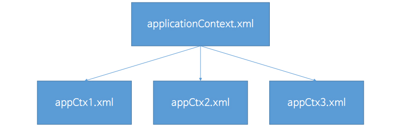
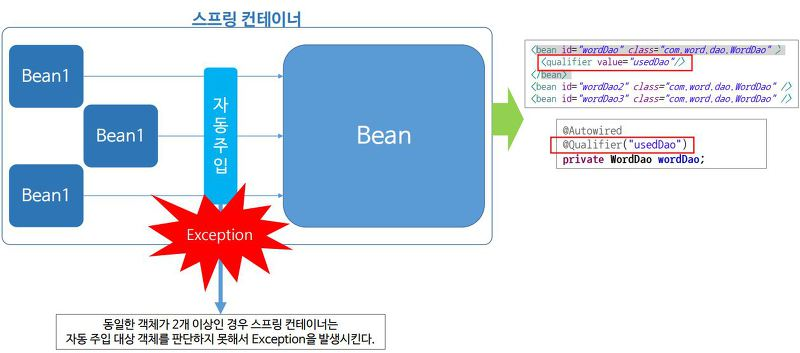

# DI(Dependency Injection)
## 1. DI(Dependency Injection, 객체 의존성) 이란?
한 객체가 다른 객체와 상호작용하고 있다면 한 객체는 다른 객체에 의존성을 가진다.
- DI는 스프링 만의 기능이 아닌 OCP의 개발 방법 중 하나이다.
- Dependency Injection : 객체들 간의 의존 관계 주입
- 장점
    - 코드 재사용을 높여 소스 코드를 다양한 곳에서 사용 가능
    - 계층, 서비스 간 의존성이 존재할 경우 Spring Framework가 연결
- Main Class : JVM이 Java Project를 실행할 때 가장 먼저 찾아가 실행시키는 class

#### (1) Java DI 설정
##### 배터리 일체형
```
public class ElectronicCarToy {
    private Battery battery;

    public ElectronicCarToy() {
        battery = new NormalBattery();
    }
}
```
- 생성자에서 Toy를 생성할 때 battery 객체를 `new`를 통해 초기화 시켜줌

##### 배터리 분리형
```
public class ElectronicrobotToy {
    private Battery battery;

    public ElectronicRobotToy() {

    }

    public void setBattery(Battery battery) {
        this.battery = battery;
    }
}
```
- 생성자에서는 toy만 생성
- `setter` 함수를 통해 battery 객체를 주입시켜 초기화 시켜줌    
    -> `new`로 객체를 초기화 하는 방법이 아닌 외부 함수인 `setter`를 통해 초기화 하는 방법을 주입이라 표현

##### Dao 참조
```
public StudentAssembler() {
    studentDao = new StudentDao();
    registerService = new StudentRegisterService(studentDao);
    modifyService = new StudentModifyService(studentDao);
    deleteService = new StudentDeleteService(studentDao);
    selectService = new StudentSelectService(studentDao);
    allSelectService = new StudentAllSelectService(studentDao);
}
```
- 각 서비스에 StudentDao라는 객체를 주입

#### (2) Spring DI 설정
```
<bean id="studentDao" class="ems.member.dao.StudentDao" ></bean>

<bean id="registerService" class="ems.member.service.StudentRegisterService">
    <constructor-arg ref="studentDao" ></constructor-arg>
</bean>

<bean id="modifyService" class="ems.member.service.StudentModifyService">
    <constructor-arg ref="studentDao" ></constructor-arg>
</bean>

<bean id="allSelectService" class="ems.member.service.StudentAllSelectService">
    <constructor-arg ref="studentDao" ></constructor-arg>
</bean>
```
- `constuctor-arg` : 생성자 주입 `ref` : 주입할 객체의 ID
- SpringContainer에서 객체를 생성하고 의존서 주입을 수행한다.

```
// (1) Container 생성
GenericXmlApplicationContext ctx = 
    new GenericXmlApplicationContext("classpath:applicationContext.xml");

// (2)
EMSInformationService informationService = 
   	ctx.getBean("informationService", EMSInformationService.class);
informationService.outputEMSInformation();

StudentRegisterService registerService = 
    ctx.getBean("registerService", StudentRegisterService.class);
```
##### GenericXmlApplicationContext 으로 Container 생성
- Container 생성시 모든 객체가 생성되고 의존 주입이 이루어진다.
##### getBean() 으로 객체 사용

## 2. 다양한 의존 객체 주입
#### (1) 생성자를 이용한 DI
`constructor-arg`태그를 이용해 `ref` 속성값에 해당하는 객체의 ID값을 넣어주면 객체가 Spring Container에서 생성될 때 바로 주입되어 생성됨
```
public StudentRegisterService(StudentDao studentDao) {
    this.studentDao = studentDao;
}
```
- StudentRegisterService 객체 생성시 생성자에 studentDao 객체를 주입시킴
```
<bean id="studentDao" class="ems.member.dao.StudentDao" ></bean>

<bean id="registerService" class="ems.member.service.StudentRegisterService ">
	<constructor-arg ref="studentDao"></constructor-arg>
</bean>
```
- `bean` 태그를 이요해 studentDao 객체 생성
- `constuctor-arg` 태그를 이용해 ref 속상 값에 해당하는 객체를 주입시켜줌

#### (2) Setter를 이용한 DI
`property` 태그에서 `name`, `value` 사용
```
public void setJdbcUrl(String jdbcUrl) {
	this.jdbcUrl = jdbcUrl;
}
public void setUserId(String userId) {
	this.userId = userId;
}
```

```
<bean id="dataBaseConnect" class="ems.member.dataBaseConnect">
	<property name="jdbcUrl" value="jdbc:oracle:thin:@localhost:1521:xe" />
    <property name="userId" value="scott" />
</bean>
```

- `property`
    - `name` : 해당하는 메소드에서 set을 떼어내고 첫 번째 글자를 소문자로 바꿔준 것을 이용
    - `value` : parameter로 들어오는 값

#### (3) List타입을 이용한 DI
List 타입이 parameter로 들어올 때 `list`태그 이용
```
public void setDevelopers(List<String> developers) {
    this.developers = developers;
}
```

```
<property name="developers">
	<list>
    	<value>Cheney.</value>
        <value>Jessie.</value>
        <value>Olivia.</value>
    </list>
</property>
```
- `property`태그에서 `list`라는 태그 내의 `value` 속성을 이용

#### (4) Map타입을 이용한 DI
```
    this.administrators = administrators;
}
```

```
<property name="administrators">
	<map>
        <entry>
            <key>
                <value>Cheney</value>
            </key>
            	<value>Cheney@SpringPjt.org</value>
        </entry>
        <entry>
            <key>
                <value>Jessie</value>
            </key>
            	<value>Jessie@SpringPjt.org</value>
        </entry>
    </map>
</property>
```
- `property`태그에서 `map`태그 내의 `entry`안에 `key` `value`

## 3. 스프링 설정 파일 분리
하나의 xml 설정 파일에 너무 많은 파일이 담기다 보면 가독성, 관리의 문제점이 있을 수 있다. 따라서 설정 파일을 효율적으로 관리하기 위해서는 분리를 해야한다.

#### (1) 분리

- 전체적인 apllicationContext.xml 파일을 보통 기능별로 분리
    - ex) Dao, Database, Information Service 등

#### (2) 문자열 배열로 분리된 파일 사용
```
// 분리 전
GenericXmlApplicationContext ctx = 
    new GenericXmlApplicationContext("classpath:applicationContext.xml");

EMSInfoService infoService = ctx.getBean("infoService", EMSInfoService.class);

// 분리 후 (문자열 배열 사용)
String[] appCtxs = 
	{"classpath:appCtx1.xml", "classpath:appCtx2.xml", "classpath:appCtx3.xml"};
GenericXmlApplicationContext ctx = 
    new GenericXmlApplicationContext(appCtxs);

EMSInfoService infoService = ctx.getBean("infoService", EMSInfoService.class);
```
- 이 방법을 선호

#### (3) Import로 분리된 파일 사용
appCtx1.xml
```
<import resource="classpath:appCtx2.xml" />
<import resource="classpath:appCtx2=3.xml" />

<bean ..... >
```
- 2번과 3번을 import해서 따로 배열을 사용하지 않고 GenericXmlAplicationContext에서 하나의 파일로만 사용 가능

## 4. 빈(Bean)의 범위
---
#### (1) 싱글톤(Singleton)
- 스프링 컨테이너의 Bean 객체는 동일한 타입에 대해서는 기본적으로 한 개만 생성이 된다
- 따라서 getBean() 메소드로 객체를 호출할 때는 동일한 객체가 반환 된다.
- 프로토타입과 반대되는 개념
- 디폴트 O
#### (2) 프로토타입(Prototype)
- 똑같은 Bean이지만 다른 타입의 객체가 생성되길 원할 때는 개발자가 별도로 설정을 해주면 된다.
- 스프링 설정 파일에서 Bean 객체를 정의할 때 해당 bean에 scope속성을 명시
    - `scope="prototype"` 명시해 주면 getBean()을 호출할 때마다 새로운 객체 생성 가능
- 디폴트 X
```
<bean id="dependencyBean" class="scope.ex.DependencyBean" scope="prototype">
    <constructor-arg ref="injectionBean" />
    <property name="injectionBean" ref="injectionBean" />
</bean>
```

## 5. 의존객체 자동 주입
의존 객체 자동 주입이란 스프링 설정 파일에서 객체를 주입할 때 나 태크로 의존 대상 객체를 명시하지 않아도 스프링 컨테이너가 자동으로 의존 설정이 필요한 객체를 찾아서 주입해주는 기능이다.

- 구현 방법
    i. @Autowired 어노테이션
    ii. @Resource 어노테이션

#### (1) @Autowired
- 자바 코드에 `@Autowired`라고 설정하면 Spring Container 내의 많은 객체들 중 객체의 타입을 찾아보고 자동으로 주입해줌
- 주입하려는 객체의 타입이 일치하는 객체를 자동으로 주입해줌
```
@Autowired
public WordRegisterService(WordDao wordDao) {
    	this.wordDao = wordDao;
}
```
- Spring Container는 wordDao 타입을 가진 bean 객체를 알아서 넣어줌

```
<beans xmlns="http://www.springframework.org/schema/beans"
	xmlns:context="http://www.springframework.org/schema/context"
	xmlns:xsi="http://www.w3.org/2001/XMLSchema-instance"
	xsi:schemaLocation="http://www.springframework.org/schema/beans 
 		http://www.springframework.org/schema/beans/spring-beans.xsd 
 		http://www.springframework.org/schema/context 
 		http://www.springframework.org/schema/context/spring-context.xsd">

    <context:annotation-config />

    <bean id="wordDao" class="com.word.dao.WordDao" />

    <bean id="registerService" class="com.word.service.WordRegisterService" />
        		<!-- 주석처리! <constructor-arg ref="wordDao" />-->
</beans>
```
- @Autowired를 명시하면 xml 파일에서 생성자 주입을 해주는 부분을 명시하지 않아도 정상적으로 작동된다
- <context:annotation-config /> 추가
    - @Autowired를 사용하기 위해서는 많은 클래스 파일들이 필요하기에namespace나 schema를 추가로 명시해줘야함. 보통 재활용
- 생성자 외에도 프로퍼티나 메소드에서도 사용하고 싶을 때는 꼭! 디폴트 생성자를 명시해줘야함
    - 객체가 생성되어야지 프로퍼티나 메소드를 사용 가능하기 때문

#### (2) @Resource
- `@Resource` 를 명시하면 Spring Container의 Bean 객체 중에 주입하려고 하는 객체의 이름이 일치하는 객체를 자동으로 주입한다
- Resource는 생성자에는 사용 X / 프로퍼티나 메소드에만 사용 O
    - 디폴트 생성자를 명시해줘야함

##### @Autowired vs @Resource
|@Autowired|@Resource|
|--|--|
|객체의 타입이 일치|객체의 이름이 일치|
|생성자 사용 O|생성자 사용 X|
|프로퍼티, 메소드 사용 O|프로퍼티, 메소드 사용 O|

```
@Resource
private WordDao wordDao;

public WordRegisterService() {
    // 디폴트 생성자
}

public WordRegisterService(WordDao wordDao) {
    	this.wordDao = wordDao;
}
```

## 6. 의존객체 선택
---
다수의 bean 객체 중 의존 객체의 대상이 되는 객체를 자동으로 선택하는 방법을 학습
#### (1) 의존 객체 선택

- 동일한 세 개의 객체 중 자동 주입 대상 객체를 판단하지 못하면 Exception 발생
- @Qualifier를 이용해서 해결
    - 어떤 객체를 우선적으로 사용할지 명시

```
@Autowired
@Qualifier("usedDao")
private WordDao wordDao;	

public WordRegisterService() {
    //Default constructor
}
```

- `@Qualifier("이름")`

- 이름을 동일하게 설정하면 에러가 뜨지는 않지만 코드가 길어지고 지저분해질 수 있기에 Qualifier를 사용하는 것을 추천

```
<context:annotation-config />

<bean id="wordDao1" class="com.word.dao.WordDao" >
	<qualifier value="usedDao" />
</bean>
<bean id="wordDao2" class="com.word.dao.WordDao" />
<bean id="wordDao3" class="com.word.dao.WordDao" />
```

- `qualifier` 태그 내 `value`로 이름 명시

#### (2) 의존객체 자동 주입 체크
```
@Autowired(required=false)
private WordDao wordDao;
```

- required 속성을 이용해 의존 대상 객체가 없어도 exception 피할 수 있음
- 거의 사용하지는 않음


#### (3) @Inject

- @Autowired와 거의 비슷하게 @Inject 어노테이션을 이용해서 의존 객체 자동 주입 가능
- @Autowired와의 차이점
    - required 속성 지원 X
    - @Qualifier 대신 @Named 어노테이션 사용
- 많이 사용되지는 않음
```
@Inject
@Named(value="wordDao1")
private WordDao wordDao;

public WordRegisterService() {
    // Default Constructor
}
```

```
<context:annotation-config />

<bean id="wordDao1" class="com.word.dao.WordDao" />
<bean id="wordDao2" class="com.word.dao.WordDao" />
<bean id="wordDao3" class="com.word.dao.WordDao" />
```
- @Autowired와 달리 설정파일에 qualifier 명시하지 않아도됨


