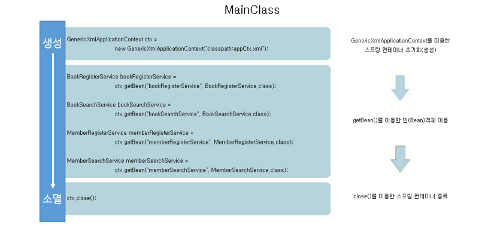
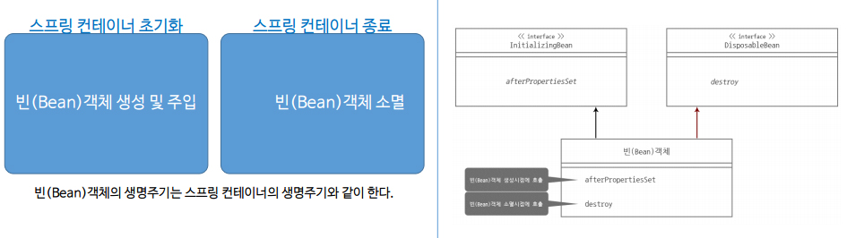

# Spring 생명주기

## 1. Spring Container 생명주기



1. Spring Container **생성**
   - GenericXmlApplicationContext을 이용해 객체를 생성한 순간
   - 컨테이너가 생성되면서 **Bean 객체도 생성**됨 (의존관계 O)
     - Spring Container 생성시점 **=** Bean 객체 생성 시점
2. GetBean()을 이용한 Bean 객체 이용
3. Spring Container **소멸**
   - ctx.close();
     - Bean 객체도 자동으로 소멸
     - 소멸 = 메모리에서 날라간다

<br>

<br>

## 2. Bean 객체 생명주기



- Bean 객체의 생명주기는 Spring Container의 생명주기와 동일

<br>

<br>

## 3. Bean LifeCycle에 맞는 초기화 방법

### (1) InitializingBean, DisposableBean 인터페이스

- Spring은 초기화, 소멸을 지원하기 위한 인터페이스 제공
- 인터페이스 : 특정한 작업이 명시만 되어있고 구체화되어있지 않은 추상적인 개념

#### InitializingBean

- **afterPropertiesSet()** 메소드
  - Bean 객체가 생성되는 시점에 호출해 특정한 작업 가능 
  - ex) DB 인증 절차

#### DisposableBean 

- **destroy()** 메소드
  - Bean 객체가 소멸되는 시점에 호출해 특정한 작업 가능
  - ex) 자원 해제

<br>

#### Appctx.xml

```xml
<?xml version="1.0" encoding="UTF-8"?>

<beans xmlns="http://www.springframework.org/schema/beans"
	xmlns:context="http://www.springframework.org/schema/context"
	xmlns:xsi="http://www.w3.org/2001/XMLSchema-instance"
	xsi:schemaLocation="http://www.springframework.org/schema/beans 
 		http://www.springframework.org/schema/beans/spring-beans.xsd 
 		http://www.springframework.org/schema/context 
 		http://www.springframework.org/schema/context/spring-context.xsd">

	<context:annotation-config />

	<bean id="bookDao" class="com.brms.book.dao.BookDao" />
    <bean id="bookRegisterService" class="com.brms.book.service.BookRegisterService "/>
    <bean id="bookSearchService" class="com.brms.book.service.bookSearchService "/>

</beans>
```

- Spring 설정파일에서 의존성 자동 주입을 위해 <context:annotation-config /> 등록

<br>

#### BookRegisterService.java

```java
public class BookRegisterService implements InitializingBean, DisposableBean {
    @Autowired
    private BookDAO bookDAO;
    public BookRegisterService() {}
    public void register (Book book) { bookDAO.insert(book) };
    
    @Override
    public void afterPropertiesSet() throws Exception {
        System.out.println("bean 객체 생성");
    }
    
    @Override
    public void destroy() throws Exception {
        System.out.println("bean 객체 소멸");
    } 
}
```

-  implements InitializingBean, DisposableBean 인터페이스
  - afterPropertiesSet()
  - destroy()

<br>

### (2) init-method, destroy-method

- 각 Bean의 속성을 이용하는 방법

- Spring 설정 파일에 Bean 객체 생성할 때 init-method, destroy-method 속성
- 속성 값과 똑같은 메소드를 해당 클래스에 작성

#### init-method

- Bean 객체가 생성되는 시점에 호출해 특정한 작업 가능 

#### destroy-method

- Bean 객체가 소멸되는 시점에 호출해 특정한 작업 가능

<br>

#### Appctx.xml

```xml
<?xml version="1.0" encoding="UTF-8"?>

<beans xmlns="http://www.springframework.org/schema/beans"
	xmlns:context="http://www.springframework.org/schema/context"
	xmlns:xsi="http://www.w3.org/2001/XMLSchema-instance"
	xsi:schemaLocation="http://www.springframework.org/schema/beans 
 		http://www.springframework.org/schema/beans/spring-beans.xsd 
 		http://www.springframework.org/schema/context 
 		http://www.springframework.org/schema/context/spring-context.xsd">

	<context:annotation-config />
	<bean id="memberDao" class="com.brms.book.dao.MemberDao" />
    <bean id="memberRegisterService" 
          class="com.brms.book.service.MemberRegisterService "
          init-method="initMethod" destroy-method="destroyMethod"/>
    <bean id="memberSearchService"
          class="com.brms.book.service.MemberSearchService "/>
</beans>

```

- Spring 설정 파일에서 bean객체를 생성할 때 method 추가
- init-method="속성값", destroy-method="속성값"

<br>

#### MemberRegisterService.java

```java
public class MemberRegisterService {
	@Autowired
	private MemberDao memberDao;	
	public MemberRegisterService() { }	
	public void register(Member member) {memberDao.insert(member);}
    
    public void initMethod() {
        System.out.println(" initMethod() ");
    }
    
    public void destroyMethod() {
        System.out.println(" destroyMethod() ");
    }
}
```

- Spring 설정파일에서 설정한 속성값에 해당하는 method 추가