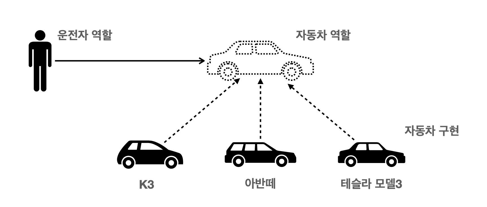

# 스프링 핵심 원리
## 1. 스프링 핵심 개념
> 스프링은 자바언어 기반의 프레임워크   
> 스프링은 객체 지향 언어가 가진 강력한 특징을 살려내는 프레임워크  
> 스프링은 좋은 객체 지향 애플리케이션을 개발할 수 있게 도와주는 프레임워크

1. 스프링 DI(Dependenci Injection) 컨테이너 기술
2. 스프링 프레임워크
3. 스프링 부트, 스프링 프레임워크 등을 모두 포함한 스프링 생태계

## 2. 스프링 부트 사용하는 이유
> 단독으로 실행할 수 있는 스프링 애플리케이션을 쉽게 생성   
> tomcat같은 웹 서버를 설치하지않아도 된다.   
> 손쉬운 빌드 구성을 위한 starter 종속성 제공   
> 스프링과 외부라이브러리 자동 구성 
> 관례에 의한 간결한 설정   
> 메트릭, 상태확인, 외부 구성 같은 프로덕션 준비 기능 제공

## 3. 좋은 객체 지향 프로그래밍이란?
> 컴포넌트를 쉽고 유연하게 변경하면서 개발할 수 있는 방법
> 클라이언트에게 영향을 주지 않고, 새로운 기능을 제공할 수 있다.

#### 3-1 객체 지향의 단점
1. 클라이언트는 대상의 역할만 알면된다.
2. 클라이언트는 구현 대상의 내부 구조를 몰라도 된다.
3. 클라이언트는 구현 대상의 내부 구조가 변경되어도 영향을 받지 않는다.
4. 클라이언트는 구현 대상 자체를 변경해도 영향을 받지 않는다.

#### 3-2 다형성(Polymorphism)
> 인터페이스를 구현한 객체 인스턴스를 유연하게 변경이 가능하다.     
> 객체를 설계할 때 역할과 구현을 명확히 분리한다.   
> 역할(인터페이스)를 먼저 부여하고, 그 역할을 구행하는 구현 객체 만들기

운전자(client)는 k3에서 테슬라로 변경해도 운전자는 자동차를 운전할 수 있다.
자동차가 내부적으로 바뀌어도 운전자에게 영향을 주지 않는다.
즉, 기존 자동차 역할을 그대로 따를 수 있으면서 자동차 종류를 무한히 확장 할 수 있다.

#### 3-3 객체지향의 단점
> 역할 자체가 변경된다면, 클라이언트와 서버 모두에 큰 변경이 발생한다.      
> 인터페이스를 안정적으로 설계하지 않으면 추후에 문제가 발생한다.   
> 인터페이스를 만드는 과정에서 추상화 비용이 발생한다.

## 4. 스프링과 객체 지향
#### 4-1 객체 지향적 설계 원칙(SOLID)
객체 지향 설계의 5가지 원칙을 정리

1. SRP(Single Responsibility Priciple) : 단일 책임의 원칙   
    : 클래스는 단 하나의 책임을 가져야 한다. 중요한 기준은 변경이다. 변경이 있을때 파급 효과가 적으면 단일 책임원칙을 잘 따른 것이다.

2. OCP(Open-Closed Priciple) : 개방-폐쇄 원칙   
    : 소프트웨어 요소는 확장에는 열려 있으나 변경에는 닫혀 있어야 한다. 인터페이스를 구현해서 새로운 클래스를 통해 새로운 기능을 구현해야 한다.
    만약 새로운 JDBC 클래스를 만든다고 해서 다른 클래스를 변경하는 것은 아니다.

3. LSP(Liskov Substitution Principle) : 리스코프 치환 원칙
    : 하위 클래스는 인터페이스 규약을 지켜야 한다. 만일 액셀 인터페이스는 속도가 10씩 증가하는 것인데 하위에서 10씩 감소하는 기능을 하는 것은 원칙을 어긴 것이다.

4. ISP(Interface Segregation Principle) : 인터페이스 분리 원칙  
    : 특정 클라이언트를 위한 인터페이스 여러개가 범용 인터페이스 하나보다 낫다. 인터페이스는 그 인터페이스를 사용하는 클라이언트를 기준으로 분리해야 한다.

5. DIP(Dependency Inversion Principle) : 의존 역전 원칙     
    : 프로그래머는 추상화에 의존해야 한다. 구현 클래스에 의존하지 말고 인터페이스에 의존하라는 뜻이다. 즉, 자동차에 대해서 알아야지 테슬라에 대해서 알아야 하는 것은 아니다.

#### 4-2 객체 지향 설계와 스프링
> 객체 지향의 핵심은 다형성이다. 하지만 다형성 만으로는 OCP, DIP를 지킬 수 없다.    
> 스프링은 DI와 DI컨테이너 제공을 통해 가능하게 만든다.

`이상적으로 모든 설계에 인터페이스를 부여` : 기능을 확장 할 가능성이 없다면 구체클래스를 직접 사용한다. 이후에 꼭 필요할 때, 리팩터링하면서 인터페이스를 도입하는 것도 방법

`객체의 협력 관계` : 혼자 존재하는 객체는 없다. 수많은 객체 클라이언트와 객체 서버는 서로 협력관계를 가진다. 클라이언트는 요청하고, 서버는 응답한다.

