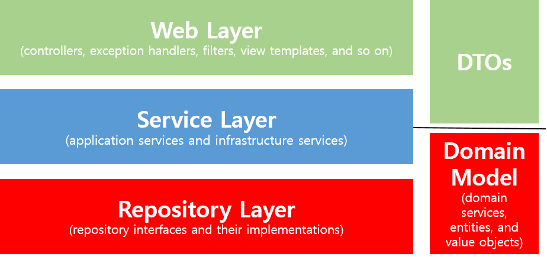

# Spring Boot에서 JPA 사용하기
## 1. JPA(Java Persistence API)란
- JPA는 여러 ORM 전문가가 참여한 EJB3.0 스펙 작업에서 기존 EJB ORM이던 Entity Bean을 JPA라고 바꾸고 JavaSE, JavaEE를 위한 영속성(persistence) 관리와 ORM을 위한 표준 기술이다, JPA는 ORM 표준 기술로 Hibernate, OpenJAVA, EclipseLink, TopLink Essentials과 같은 구현체가 있고 이에 표준 인터페이스가 바로 JPA이다.

- ORM(Object Relational Mapping)이란 RDB테이블을 객체지향적으로 사용하기 위한 기술이다. RDB 테이블은 객체지향적 특징(상속, 다형성, 레퍼런스, 오브젝트 등)이 없고 자바와 같은 언어로 접근하기 쉬지 않기 때문에 ORM을 사용해 오브젝트와 RDB 사이에 존재하는 개념과 접근을 객체지향적으로 다루기 위한 기술이다.

### 장점
- 객체지향적으로 데이터를 관리할 수 있기 때문에 비즈니스 로직에 집중 할 수 있으며, 객체지향 개발이 가능하다.
- 테이블 생성, 변경, 관리가 쉽다.
- 로직을 쿼리에 집중하기 보다는 객체자체에 집중 할 수 있다.
- 빠른 개발이 가능하다.

### 단점
- 장점을 더 극대화 하기 위해서 알아야 할 게 많다.
- 잘 이해하고 사용하지 않으면 데이터 손실이 있을 수 있다.(persistance context)
- 성능상 문제가 있을 수 있다.
## ORM(Object-relational mapping) 이란
- Object-relational mapping(객체 관계 매핑)
    - 객체는 객체대로 설계하고, 관계형 데이터베이스는 관계형 데이터베이스대로 설계한다.
    - ORM 프레임워크가 중간에서 매핑해준다.
- 대중적인 언어에는 대부분 ORM 기술이 존재한다.
- ORM은 객체와 RDB `두 기둥 위에 있는 기술`이다.
```
- MyBatis, iBatis는 ORM이 아니다. SQL Mapper
- ORM은 객체르 매핑하는 것이고, SQL Mapper는 쿼리를 매핑하는 것
```

# 2. 요구사항 분석
jpa 기능을 사용하여 게시판과 회원 기능을 구현
> `post 기능`
> - post 조회
> - post 등록
> - post 수정
> - post 삭제
>       

> `member 기능`
> - 구글/ 네이버 로그인
> - 로그인한 사용자 글 작성 권한
> - 본인 작성 글에 대한 권한 권리
>       

# 3. Spring Data JPA 적용하기
먼저 build.gradle 에 다음과 같이 
org.springframework.boot:spring-boot-starter-data-jpa 와 com.h2database:h2 의존성들을 등록한다.

```
dependencies {
    compile('org.springframework.boot:spring-boot-starter-web')
    compile('org.projectlombok:lombok')
    compile('org.springframework.boot:spring-boot-stater-data-jpa')
    compile('com.h2database:h2')
    testCompile('org.springframework.boot:spring-boot-starter-test')
}
```

### 코드 설명
    1. spring-boot-starter-data-jpa
        - 스프링 부트용 Spring Data Jpa 추상화 라이브러리
        - 스프링 부트 버전에 맞춰 자동으로 JPA관련 라이브러리들의 버전을 관리해준다.
    2. H2
        - 인메모리 관계형 데이터베이스
        - 별도의 설치가 필요 없이 프로젝트 의존성만으로 관리할 수 있다.
        - 메모리에서 실행되기 때문에 애플리케이션 재시작할 때마다 초기화된다.

# Entity 클래스 생성
```java
package -.-.-;

import lombok.*;
import javax.*;

@Getter
@NoArgsConstuctor
@Entity
public class Posts {
    @Id
    @GeneratedValue(stategy=GenerationType.IDENTITY)
    private Long id;
    @Column(length=500, nullable=false)
    private String title;
    @Column(columnDefinition="TEXT", nullable=false)
    private String content;
    private String author;

    @Builder
    pulbic Posts(String title, String content, String author) {
        this.title = title;
        this.content = content;
        this.author = author;
    }
}

```

### 코드설명
    1. @Entity
        - 테이블과 링크될 클래스임을 나타낸다.
        - 기본값으로 클래스의 카멜케이스 이름은 언더스커어(_) 네이밍으로 테이블 이름 매칭
        - UserManager.java -> user_manager table

    2. @GeneratedValue
        - PK 생성 규칙
        - 스프링 부트 2.0에서는 GenerationType.IDENTIFY 옵션을 추가해야만 auto_increament가된다.

    3. @Id
        - 해당 테이블의 PK 필드를 나타낸다.
    
    4. @Column
        - 테이블의 컬럼을 나타내며 굳이 선언하지 않더라도 해당 클래스의 필드는 모두 컬럼이된다
        - 기본 값 외에 추가로 변경이 필요한 옵션이 있으면 사용

    5. @Builder
        - 해당 클래스의 빌더 패턴 클래스를 생성
        - 생성자 상단에 선언 시 생성자에 포함된 필드만 빌더에 포함

Posts 클래스 특이점
- setter 메소드가 없다. 자바 빈 규약을 보면 getter/setter를 무작정 생성하는 경우 클래스의 인스턴스 값들이 언제 변경되는지 명확하게 알 수 없다.

- Entity 클래스에서는 절대 Setter 메소드를 만들지 않는다.
```java
잘못된 사용 
public class Order {
    public void setStatus(boolean status) {
        this.status = status;
    }
}
public void 주문서비스의 취소이벤트() {
    order.setStatus(false);
}

올바른 사용
public class Order {
    public void cancelOrder() {
        this.status = status;
    }
}
public void 주문서비스의 취소 이벤트() {
    order.cancelOrder();
}
```
Post 클래스 생성이 끝났다면, Post 클래스로 Database를 접근하게 해 줄 JpaRepository를 생성한다.

```java
PostsRepository
    package -.-.-;

    import org.springframework.data.jpa.repositroy.JpaRepository;

    public interface PostsRepository extends JpaRepository<Posts, Long> {

    }
```

보통 ibatis나 MyBatis 등에서 Dao라고 불리는 DB Layer 접근자입니다. JPA에선 Repository라고 부르며 인터페이스로 생성, 인터페이스 생성 후 JpaRepository<Entity 클래스, PK 타입>을 상속하면 기본적인 CRUD 메소드가 자동으로 생성된다.

- @Repository를 추가할 필요 없다.
- Entity 클래스와 기본 Entity Repository는 함께 위치해야 한다.

# 4. Spring Data JPA 테스트 코드 작성
- PostsRepositoryTest 클래스 생성

```java
package -.-.-;

import com.package루트;
import org.junit.*;
import org.springframework.*;

import java.util.List;

import static org.assertj.core.api.Assertions.assertThat;

@RunWith(SpringRunner.class)
@SpringBootTest
public class PostsRepositoryTest {
    @Autowired
    PostsRepository postsRepository;
    @After
    public void cleanup() {
        postsRepository.deleteAll();
    }
    @Test
    public void 게시글저장_불러오기() {
        //given
        String title = "테스트 게시글";
        String content = "테스트 본문";

        postsRepository.save(Posts.builder().title(title).content(content).author("test01@gamil.com").build());

        // when
        List<Posts> postsList = postsRepository.findAll();

        // then
        Posts posts = postsList.get(0);
        assertThat(posts.getTitle()).isEqualTo(title);
        assertThat(posts.getContent()).isEqualTo(content);
    }
}
```

코드 설명

    1. @After
        - Junit에서 단위 테스트가 끝날 때마다 수행되는 테스트
        - 보통은 배포 전 전체 테스트를 수행할 때 테스트간 데이터 침범을 막기 위해 사용한다.
        - 여러 테스트가 동시에 수행되면 테스트용 데이터베이스인 H2에 데이터가 그대로 남아 있어 다음 테스트 실행 시 테스트가 실패할 수 있다.

    2. postsRepository.save
        - 테이블 posts에 insert/update 쿼리를 실행한다.
        - id 값이 있다면 update, 없다면 insert 쿼리가 실행된다.
    
    3. postsRepository.findAll
        - 테이블 posts에 있는 모든 데이터를 조회해오는 메소드

    4. @SpringBootTest
        - 별 다른 설정 없으면 H2데이터 베이스를 자동으로 실행해준다.

## 쿼리 로그 추가
> apllication.properties
>   `spring.jpa.show-sql=true`
> - create table 쿼리를 보면 id bigint generated by default as identity라는 옵션으로 생성된다.
> - 이는 H2 쿼리 문법으로 적용되었기 때문이다.
> - 출력 되는 쿼리 로그는 MySql버전으로 변경해보자
> 
> application.properties
> 
> `spring.jpa.show-sql=true`
> 
> `spring.jpa.properties.hibernate.dialect=org.hibernate.dialect.MySQL5InnoDBDialect`

# 5. 등록/ 수정/ 조회 api 만들기
API를 만들기 위해 총 3개의 클래스가 필요하다.
1. Requests 데이터를 받을 Dto
2. API 요청을 받을 controller
3. 트랜잭션, 도메인 기능 간의 순서를 보장하는 서비스

Service는 `트랜잭션, 도메인 간 순서 보장` 의 역할만 한다.

## Spring 웹 계층

- Web Layer
    - 흔히 사용되는 컨트롤러(@Controller)와 JSP/ freemarker 등 뷰 템플릿 영역입니다.
    - 이외에도 필터(@Filter), 인터셉터, 컨트롤러 어드바이스(@ControllerAdvice)등 외부 요청과 응답에 대한 전반적인 영역을 야기 한다.

- Service Layer
    - @Service에 사용되는 서비스 영역
    - 일반적으로 Controller와 Dao의 중간 영역에서 사용
    - @Transactional이 사용되어야 하는 영역

- Repository Layer
    - Database와 같이 데이터 저장소에 접근하는 영역
    - Dao(Data Access Object) 영역

- Dtos
    - Dto(Data Transfer Object)는 계층 간에 데이터 교환을 위한 객체

- Domain Model
    - 도메인이라 불리는 개발 대상을 모든 사람이 동일한 관점에서 이해할 수 있고 공유할 수 있도록 단순화시킨 것을 도메인 모델이라고 한다.
    - 이를 테면 택시 앱이라고 하면 배차, 탑승, 요금 등이 모두 도메인이 될 수 있다.
    - @Entity가 사용된 영역이 도메인 모델이다.

`Web, Service, Repository, Dto, Domain`이 5가지 레이어에서 비지니스 처리를 담당해야 할 곳은 바로 Domain이다.

기존에 서비스로 처리하던 방식을 트랜잭션 스크립트라고 한다. 주문 취소 로직을 작성

```java

슈도 코드(`프로그램을 작성할 때 각 모듈이 작동하는 논리를 표현하기 위한 언어이다. 특정 프로그래밍 언어의 문법에 따라 쓰인 것이 아니라, 일반적인 언어로 코드를 흉내 내어 알고리즘을 써놓은 코드를 말한다.`)

@Transactional
public Order cancelOrder(int orderId) {
    1) 데이터베이스로부터 주문정보(Orders), 결제 정보(Billing), 배송정보(Delivery) 조회
    2) 배송 취소를 해야 하는지 확인
    3) if (배송중이라면) {
        배송 취소로 변경
    }
    4) 각 테이블에 취소 상태 update
}

실제 코드

@Transactional
public Order cancelOrder(int orderId) {
    // 1)
    OrderDto order = ordersDao.selectOrders(orderId);
    BillingDto billing = billingDao.selectBiling(orderId);
    DeliverDto delivery = deliveryDao.selectDelivery(orderId);
    // 2)
    String deliveryStatus = delivery.getStatus();
    // 3)
    if ("IN_PROGRESS".equals(deliveryStatus)) {
        delivery.setStatus("CANCEL");
        deliveryDao.update(delivery);
    }
    // 4)
    order.setStatus("CANCEL");
    orderDao.update(order);
    // 5)
    billing.setStatus("CANCEL");
    billingDao.update(billing);

    return order;
}

모든 로직이 `서비스 클래스 내부에서 처리됩니다.` 그러다 보니 `서비스 계층이 무의미하며, 객체란 단순히 데이터 덩어리` 역할만 하게 된다.

```
반면 도메인 모델에서 처리할 경우 다음과 같은 코드가 될 수 있다.

```java
@Transactional
public Order cancelOrder(int orderId) {
    // 1)
    Order order = orderRepository.findById(orderId);
    Billing billing = billingRepository.findById(orderId);
    Delivery delivery = deliveryRepository.findById(orderId);
    // 2-3)
    delivery.cancel();
    // 4)
    order.cancel();
    billing.cancel();

    return order;
}

order, billing, delivery가 각자 본인의 취소 이벤트 처리를 하면, `서비스 메소드는 트랜잭션과 도메인 간의 순서만 보장`해 준다.
```

위 방법과 같이 등록, 수정, 삭제 기능 추가

- Controller, Service, Dto 새엇ㅇ

## 등록
### PostsApiController
```java
package -.-.-;
import 패키지;
import lombok.*;
import org.springframework.web.*;

@RequiredArgsConstructor
@RestController
public class PostsApiController {
    private final PostService postService;

    @PostMapping("/api/v1/posts")
    public Long save(@RequestBody PostsSaveRequestDto requestDto) {
        return postSerice.save(requestDto);
    }
}
```

### PostService
```java
package -.-.-;

import 패키지;
import lombok.*;
import org.springframework.*;

@RequriedArgsConstructor
@Service
public class PostService {
    private final PostsRepository postsRepository;

    @Transactional
    public Long save(PostsSaveRequestDto requestDto) {
        return postsRepository.save(requestDto.toEntity()).getId();
    }
}

스프링에서 Bean을 주입받는 방식
- @Autowired
- setter
- 생성자
```
생성자를 주입받는 방식을 권장. 생성자로 Bean객체를 받도록 하면 @Autowired와 같은 효과를 볼 수 있다.
- @RequiredArgsConstructor를 통해 final이 선언된 모든 필드를 생성

### PostsSaveRequestDto
```java
package -.-.-;
import 패키지;
import lombok.*;

@Getter
@NoArgsConstructor
pulic class PostsSaveRequestDto {
    private String title;
    private String content;
    private String author;

    @Builder
    public PostsSaveRequestDto(String title, String content, String author) {
        this.title = title;
        this.content = content;
        this.author = author;
    }

    public Posts toEntity() {
        return Posts.builder().title().content().author().build();
    }
}
```

여기서 Entity 클래스와 거의 유사한 형태임에도 Dto 클래스르 추가로 생성, 하지만 Entity 클래스를 Request/ Response 클래스로 사용하면 안된다.
Entity 클래스는 데이터베이스와 맞닿은 핵심 클래스이다.
- View Layer와 DB Layer의 역할 분리

### PostsApiControllerTest
```java
package -.-.-;

import 패키지;
import org.junit.*;
import org.springframework.*;

import java.util.List;
import static org.assertj.core.api.Assertions.assertThat;

@RunWith(SpringRunner.class)
@SpringBootTest(webEnvironment= SpringBootTest.WebEnvironment.RANDOM_POST)
public class PostsApiControllerTest {
    @LocalServerPort
   private int port;

   @Autowired
   private TestRestTemplate restTemplate;

   @Autowired
   private PostsRepository postsRepository;

   @After
   public void tearDown() throws Exception {
       postsRepository.deleteAll();
   }

   @Test
   public void Posts_등록된다() throws Exception {
       //given
       String title = "title";
       String content = "content";
       PostsSaveRequestDto requestDto = PostsSaveRequestDto.builder()
               .title(title)
               .content(content)
               .author("author")
               .build();

       String url = "http://localhost:" + port + "/api/v1/posts";

       //when
       ResponseEntity<Long> responseEntity = restTemplate.postForEntity(url, requestDto, Long.class);

       //then
       assertThat(responseEntity.getStatusCode()).isEqualTo(HttpStatus.OK);
       assertThat(responseEntity.getBody()).isGreaterThan(0L);

       List<Posts> all = postsRepository.findAll();
       assertThat(all.get(0).getTitle()).isEqualTo(title);
       assertThat(all.get(0).getContent()).isEqualTo(content);
   }
}
```

- @WebMvcTest의 경우 JPA 기능이 작동하지 않기 때문에 사용하지 않는다.
- @SpringBootTest와 TestRestTemplate 사용
- SpringBootTest.WebEnvironment.RANDOM_PORT 랜덤 포트 사용

## 수정/ 조회
### PostsApiController
```java
package -.-.-;
import 패키지;
import lombok.*;
import org.springframework.web.*;

@RequiredArgsConstructor
@RestController
public class PostsApiController {
    private final PostService postService;

    ....

    @PutMapping("/api/v1/posts/{id}")
    public Long update(@PathVariable Long id, @RequestBody PostsUpdateRequestDto requestDto) {

        return postService.update(id, requestDto);
    }

    @GetMapping("/api/v1/posts/{id}")
    public PostsResponseDto findById (@PathVariable Long id) {

        return postService.findById(id);
    }
}
```

### PostsResponseDto
```java
package -.-.-;

import 패키지;
import lombok.Getter;

@Getter
public class PostsResponseDto {
    private Long id;
    private String title;
    private String content;
    private String author;

    public PostsResponseDto(Posts entity) {
        this.id = entity.getId();
        this.title = entity.getTitle();
        this.content = entity.getContent();
        this.author = entity.getAuthor();
    }
}
```

### PostsResponseDto
```java
package -.-.-;

import lombok.*;

@Getter
@NoArgsConstuctor
public class PostsUpdateRequestDto {
    private String title;
    private String content;

    @Builder
    public PostsUpdateRequestDto(String title, String content) {
        this.title = title;
        this.content = content;
    }
}
```

### Posts
```java
@Getter
@NoArgsConstructor
@Entity
public class Posts {
    ...

    public void update(String title, String content) {
        this.title = title;
        this.content = content;
    }
}
```

### PostService
```java
@RequiredArgsConstuctor
@Service
public class PostService {
    ...

    @Transactional
    public Long update(Long id, PostsUpdateRequestDto requestDto) {
        Posts posts = postsRepository.findById(id).orElseThrow(() -> new IllegalArgument Exception("해당 게시글이 없습니다. id=" + id));
        posts.update(requestDto.getTitle(), requestDto.getContent());
        return id;
    }
    public PostsResponseDto findById(Long id) {
        Posts Entity = postsRepository.findById(id).orElseThrow(() -> new IllegalArgumentException("해당 게시글이 없습니다. id=" + id));

        return new PostsResponseDto(entity);
    }
}
```

출처<https://velog.io/@swchoi0329/Spring-Boot%EC%97%90%EC%84%9C-JPA-%EC%82%AC%EC%9A%A9%ED%95%98%EA%B8%B0#entity-%ED%81%B4%EB%9E%98%EC%8A%A4-%EC%83%9D%EC%84%B1>