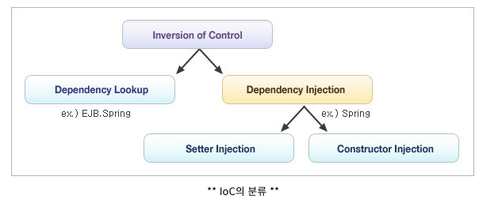
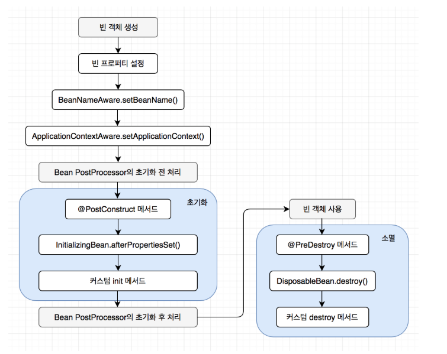

# IoC 컨테이너와 빈
## IoC (Inversion of Control, 제어의 역전) 
의존 관게 주입(Dependency Injection)이라고도 하며, 어떤 객체가 사용하는 의존객체를 직접 만들어 사용하는게 아닌, 주입받아 사용하는 방식을 말함   
즉, 인스턴스의 생성부터 소멸까지의 생명주기를 개발자가 아닌 컨테이너가 대신 해준다는 뜻

## 스프링 IoC / DI 컨테이너
### **BeanFactory : 스프링의 컨테이너 기능을 담당**
- 스프링의 설정 파일에 등록된 bean객체를 관리하는 가장 기본적인 컨테이너 기능 제공
- 컨테이너가 구동될 때 객체를 생성하는 것이 아닌 클라이언트의 요청에 의해서만 객체를 생성(Lazy loading)

어플리케이션 컴포넌트의 중앙저장소  
빈 설정 소스(XML, Java config..)로 부터 빈 정의를 읽어 들이고, 빈을 구성하고 제공

## 빈
### 자바 빈
데이터를 표현하는 것을 목적으로 하는 자바클래스(클래스에 값을 저장하는 속성필드, get, set 메소드, 기본 생성자 포함)

## 스프링 빈
스프링 IoC 컨테이너가 관리하는 객체
### 장점
- 의존성 관리
- 스코프
    - singleton : 기본
    - prototype : 어플리케이션 요청시 마다 스프링이 새 인스턴스 생성
    - request : HTTP 요청별로 인스턴스화 되어 요청이 끝나면 소멸(Spring MVC 용도)
    - session : HTTP 세션별로 인스턴스화 되어 세션이 끝나면 소멸(Spring MVC 용도)
    - global session : 포를릿 기반의 웹 어플리케이션 용도, 전역 세션 스코프의 빈은 같은 스프링 MVC를 사용한 포탈 어플리케이션 내의 모든 포를릿 사이에 공유 가능
    - thread : 새 스레드에서 요청하면 새로운 bean 인스턴스를 생성, 같은 스레드에선 항상 같은 bean 반환
    - custom : org.springframework.beans.factory.config.Scope 를 구현하고 커스텀 스코프를 스프링의 설정에 등록하여 사용

- 라이프 사이클 인터페이스
- 객체 생성 => 의존설정 -> 초기화 -> 소멸

